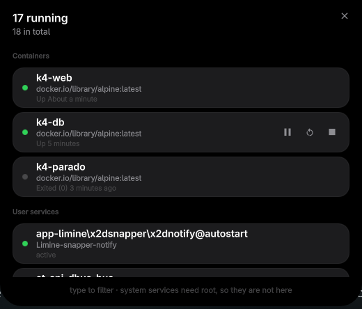

# Engine room, for k4

**What is running on this machine, and the buttons to stop it.**

Containers and user services in one list, sorted by what you came to touch.
The companion to [k4-puertos](https://github.com/k4ditano/k4-puertos): that one
answers *what is listening*, this one answers *what is up* — and lets you do
something about it without going back to a terminal.



## Install

From the bar: **Settings → Plugins → Discover**.

From the terminal:

```sh
cd ~/.config/quickshell/k4
python3 tools/plugins.py --install https://github.com/k4ditano/k4-sala --commit <sha>
quickshell ipc -p shell.qml call k4 pluginEnable sala
```

It installs the exact commit you name, not the tip of a branch.

## What it lists

- **Containers**, from docker or podman — whichever you have, both if you have
  both — **including the stopped ones**. Wanting to start one that fell over is
  half the reason to open this.
- **User services**, from `systemctl --user`, and only the ones **running or
  failed**. Listing the hundreds that are stopped would be noise: nobody
  remembers a stopped service, and whoever does is already in a terminal.

If a container engine is installed but its daemon is not answering, it says so.
A short list because the daemon is down reads exactly like *«I have nothing»*,
and those are not the same thing.

## The buttons

They appear under the pointer, and only the ones that make sense for that row:

| | |
|---|---|
| **▶** | start what is stopped, resume what is paused |
| **⏸** | pause — containers only. systemd does not freeze a service, it stops it, and offering both under one icon would lie about what is about to happen |
| **↻** | restart |
| **■** | stop — **asks first** |

Pause, resume and restart undo themselves. Stop cuts the thing off, so it
arms the row instead: the first press turns it red and says so, the second one
does it. It disarms itself after four seconds, because a loaded stop button
waiting quietly is a trap.

While something is changing — a container `stopping`, a service `activating` —
the row shows **no buttons at all** and its dot pulses. It is not stopped, it
is stopping, and offering a play button there would be a lie.

## Finding it

| | |
|---|---|
| Shortcut | `k4:sala` — bind it in your Hyprland config |
| Launcher | type `docker`, `podman`, `services`… |
| App centre | *Sala de máquinas* (SUPER+SHIFT+Space) |
| IPC | `k4.sala abrir` · `cerrar` · `alternar` · `lista` |

With the list open, **just type** to filter — by name or by image. `Esc`
disarms, then clears the filter, then closes. So does the **✕**, and tapping
the background.

## What it will not do

**System services are not here.** Stopping one needs root, and asking for root
from a bar means `pkexec` or a passwordless sudo rule — both blocked by k4's
plugin validator under the `sudo-sin-contrasena` rule, and rightly: anything
running as you could invoke it. A bar plugin is not the place.

Containers work without root because that is how they already work for you:
podman rootless, or your user in the `docker` group.

## When it runs

**Only while you are looking.** The probe runs when the list opens and every
four seconds while it stays open, and does not exist the rest of the time.

## Two things worth knowing if you fork this

**The icons use `renderType: Text.NativeRendering`, on purpose.** A Nerd Font
carries ~13.500 glyphs, and Qt Quick's distance-field atlas mis-resolves
codepoints outside the BMP — where every `md-*` icon lives (U+F0000+). The
symptom is not a missing icon, it is **a different icon**, and the same
codepoint can be right in one view and wrong in another depending on what got
cached first.

**`K4.Baldosa` ties its MouseArea to `pulsable`.** Setting `pulsable: false` to
stop a row from looking clickable also kills `containsMouse`, so anything that
appears on hover never appears at all. This one keeps a `Qt.NoButton`
MouseArea of its own for the hover, and lets the buttons keep the clicks.

MIT.
